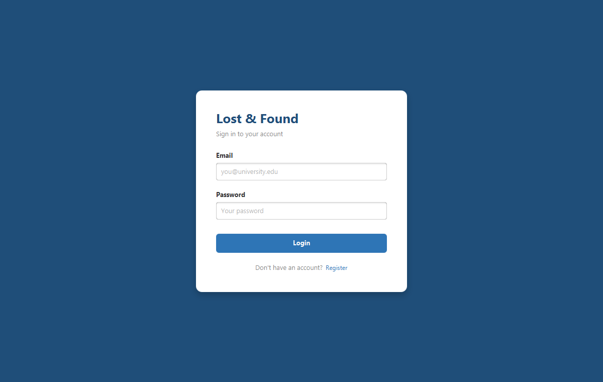
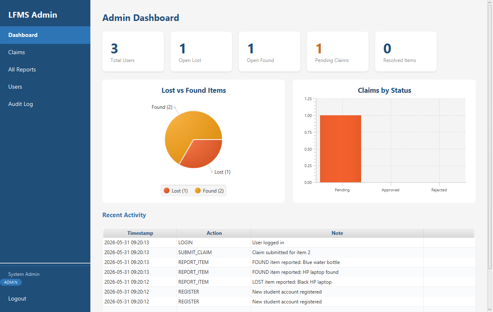
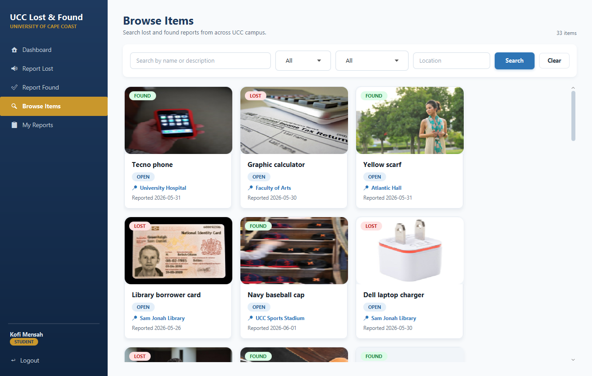
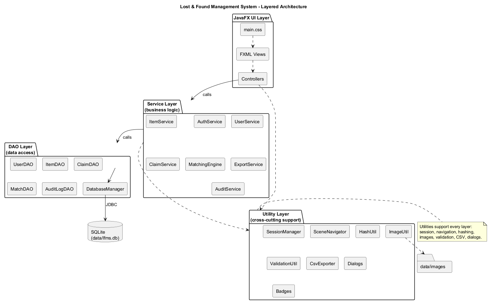
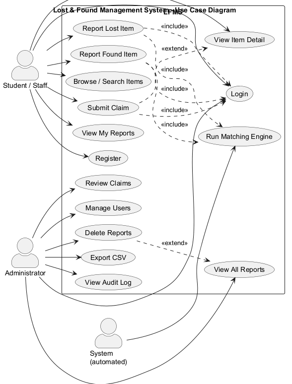
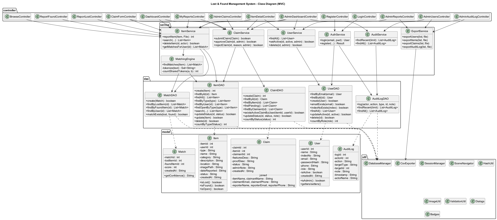
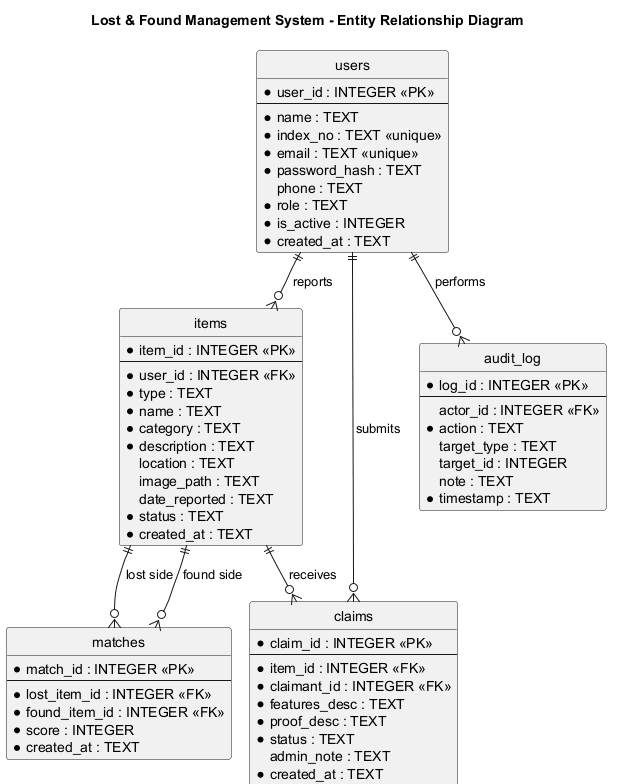

# Lost & Found Management System

> A JavaFX desktop application for managing lost and found items on a university campus.


The Lost & Found Management System (LFMS) lets students and staff report items they have
lost or found, browse and search the catalogue, and claim found items. Administrators
review claims, manage users and reports, export data, and audit every action. An automated
**matching engine** suggests likely lost ↔ found pairings.

---

## Features

**Students / Staff**
- Register and log in (passwords hashed with BCrypt)
- Report **lost** and **found** items, with optional/required image upload
- Browse and search the full catalogue by keyword, type, category and location
- View detailed item pages and **claim** found items with proof of ownership
- Track personal lost items, found items and claims under **My Reports**
- See **suggested matches** generated automatically by the matching engine

**Administrators**
- Dashboard with key statistics and **live charts** (Lost vs Found pie chart, Claims-by-status bar chart)
- Review pending claims and **approve** or **reject** them (with a reason)
- Manage all reports: search, change status, delete (with reason), **export to CSV**
- Manage users: real-time search, activate/deactivate, delete, **export to CSV**
- Full **audit log** with keyword/date filtering and CSV export

---

## Tech Stack

| Layer | Technology |
|-------|------------|
| Language | Java (compiled to release 17) |
| UI | JavaFX 21 (FXML + CSS) |
| Database | SQLite via `org.xerial:sqlite-jdbc` |
| Password hashing | BCrypt (`org.mindrot:jbcrypt`) |
| Build tool | Apache Maven (Maven Wrapper bundled) |
| Architecture | Strict MVC — Controller → Service → DAO → Database |

---

## Prerequisites

- **JDK 17 or newer** (developed and verified on JDK 26)
- Apache Maven is **optional** — the project ships with the Maven Wrapper (`mvnw`)

Check your JDK:

```bash
java -version
```

---

## Getting Started (Installation & Running)

Using the bundled **Maven Wrapper** — no local Maven installation required:

```bash
git clone <repo-url>
cd lost-and-found

# Windows
mvnw.cmd javafx:run

# macOS / Linux
./mvnw javafx:run
```

Or, if you already have Maven installed:

```bash
mvn javafx:run
```

The wrapper downloads Maven, JavaFX and the other dependencies automatically on first run,
then launches the application at the Login screen.

> **Windows note:** ensure a JDK 17+ is installed and `JAVA_HOME` points to it
> (e.g. `C:\Program Files\Java\jdk-26.0.1`). The SQLite database and uploaded images are
> created automatically under `data/`.

> **Tip — instant demo:** on the Login screen click **“Load demo data”** to populate the
> app with sample students, lost/found items (with matches) and a pending claim, so you can
> explore every feature right away.

---

## Default Admin Account

| Field | Value |
|-------|-------|
| Email | `admin@lfms.edu` |
| Password | `Admin@1234` |

This account is seeded automatically on first launch.
**Note:** change the password after first login in a production setting.

**Demo accounts:** “Load demo data” on the Login screen also creates sample students, e.g.
`kofi@university.edu` / `Password1`.

---

## Screenshots

| Login | Admin Dashboard |
|-------|-----------------|
|  |  |

| Browse Items |
|--------------|
|  |

---

## Project Structure (brief)

```
lost-and-found/
├── pom.xml                     Maven build configuration
├── mvnw, mvnw.cmd, .mvn/       Maven Wrapper (run without installing Maven)
├── README.md
├── data/                       SQLite database + uploaded images (created at runtime)
├── docs/
│   ├── diagrams/               UML: use-case, class, ER, architecture (PlantUML + PNG)
│   └── screenshots/            README screenshots
├── src/
│   ├── main/java/com/lfms/
│   │   ├── Main.java / App.java     Launcher + JavaFX application
│   │   ├── database/                DatabaseManager (schema + admin seed)
│   │   ├── model/                   User, Item, Claim, Match, AuditLog
│   │   ├── dao/                      Data-access objects (JDBC only here)
│   │   ├── service/                 Business logic (Auth, Item, Claim, Matching, …)
│   │   ├── controller/              JavaFX controllers (+ admin/)
│   │   └── util/                     Session, navigation, hashing, images, CSV, …
│   └── main/resources/com/lfms/
│       ├── fxml/                    14 screens (+ admin/) + shared sidebars
│       ├── css/main.css             Application stylesheet
│       └── images/placeholder.png
└── src/test/test-cases.md           25 functional test cases
```

---

## Architecture

The application follows a strict layered MVC design:

```
FXML + CSS  →  Controllers  →  Services  →  DAOs  →  DatabaseManager  →  SQLite
```

- **Controllers** never touch JDBC; they call **Services**.
- **Services** hold the business logic and call **DAOs**.
- **DAOs** are the only classes that use JDBC `Connection`/`PreparedStatement`.
- **Utilities** (session, navigation, hashing, images, validation, CSV, dialogs) support all layers.



### Use Case Diagram



### Class Diagram



PlantUML sources for all diagrams live in [`docs/diagrams/`](docs/diagrams).

---

## Database Schema

Five tables created automatically with `CREATE TABLE IF NOT EXISTS`:
`users`, `items`, `claims`, `matches`, `audit_log`.



---

## Testing

Twenty-five manual functional test cases covering every module are documented in
[`src/test/test-cases.md`](src/test/test-cases.md).

---

## Team

| Name | Index / ID | Role |
|------|------------|------|
| _Add your name_ | _Index no._ | _e.g. Backend / DAO_ |
| _Add your name_ | _Index no._ | _e.g. UI / Controllers_ |
| _Add your name_ | _Index no._ | _e.g. Documentation / Testing_ |

> Developed for **INNF101 — Introduction to Computing**.

---

## License

Released for academic use under the MIT License. See course submission guidelines for details.
